# Laporan Praktikum Pertemuan 8
## DOUBLY LINKED LIST
 
NAMA  : DIMAS ROSYIDIN

NIM   : 2241760054  

KELAS : 2B

PRODI : SISTEM INFORMASI BISNIS

JURUSAN : TEKNOLOGI INFORMASI

* ### Praktikum 1

OUTPUT :

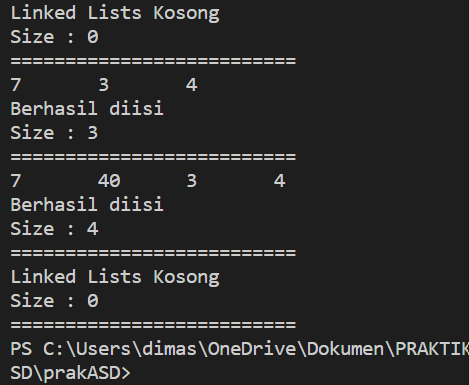

Pertanyaan
- Jelaskan perbedaan antara single linked list dengan doubly linked lists!
Perhatikan class Node, di dalamnya terdapat atribut next dan prev. Untuk apakah atribut
tersebut?

    Jawab : 
    - Single Linked List : Setiap node hanya memiliki satu referensi yaitu ke node berikutnya (next)

    - Doubly Linked List : Setiap node memiliki dua referensi (prev) ke node sebelumnya dan (next) ke node berikutnya

- Perhatikan konstruktor pada class DoublyLinkedList. Apa kegunaan inisialisasi atribut head dan size?

    Jawab : 
    - head : digunakan untuk menunjukkan node pertama dalam linked list
    - size : digunakan untuk mencari jumlah elmen dalam linked list

- Pada method addFirst(), mengapa dalam pembuatan objek dari konstruktor class Node prev dianggap sama dengan null?

        head = new Node(null, data, null);

    Jawab : karena ini adalah penambahan pertama jadi tidak ada node sebelumnya (prev)

- Perhatikan pada method addFirst(). Apakah arti statement head.prev = newNode?

    Jawab : untuk mengatur node pertama (head) jadi new node digunakan untuk menambahkan node baru

- Perhatikan isi method addLast(), apa arti dari pembuatan objek Node dengan mengisikan parameter prev dengan current, dan next dengan null?

        Node newNode = new Node(current, data, null);

    Jawab : jika menambahkan node baru diakhir jadi untuk (prev) diatur sebagai (current) dan (next) diatur menjadi null karena node saat ini berada posisi akhir

- Pada method add(), terdapat potongan kode program sebagai berikut,

        if (current.prev == null) {
            Node newNode = new Node(null, data, current);
            current.prev = newNode;
            head = newNode;
        }     
    
    Jawab : untuk menambahkan node pertama atau head dalam linked list, sehingga (prev) berisi null. dan new node akan ditambahkan pada node pertama di linked list

* ### Praktikum 2

OUTPUT :

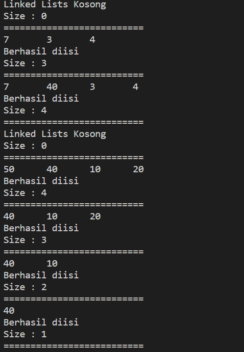

Pertanyaan

- Apakah maksud statement berikut pada method removeFirst()?

head = head.next;
head.prev = null;

    Jawab :
    - head = head.next; akan mengganti head dengan node berikutnya, sehingga node pertama akan diabakian
    - head.prev = null; ini akan mengatur dari node baru yang menjadi head atau node pertama untuk menghapus referensi ke node sebelumnya

- Bagaimana cara mendeteksi posisi data ada pada bagian akhir pada method removeLast()?

    Jawab : menggunakan if (current.next == null) untuk mendeteksi apakah current berada pada node terakhir. jika ya makan akan terhapus

- Jelaskan alasan mengapa potongan kode program di bawah ini tidak cocok untuk perintah remove!

        Node tmp = head.next;
        head.next = tmp.next;
        tmp.next.prev = head;

    Jawab : untuk menghapus node yang berada ditengah bukan diujung, ini akan menyebabkan (prev) dan (next) yang tidak cocok

- Jelaskan fungsi kode program berikut ini pada fungsi remove!

        current.prev.next = current.next;
        current.next.prev = current.prev;

    Jawab : untuk menghapus node (current) dari linked list dengan mengatur referensi sekitarnya. (current.prev.next) pada node yang sebelumnya menunjuk ke (current), dan mengubahnya sehingga sekarang mengacu pada (current.next). Ini memotong (current) dari linked list. Kemudian, (current.next.prev) mengacu pada node yang sebelumnya menunjuk ke (current.next), dan mengatur prevnya untuk mengacu ke (current.prev), menyelesaikan proses penghapusan node (current).

* ### Praktikum 3

OUTPUT :

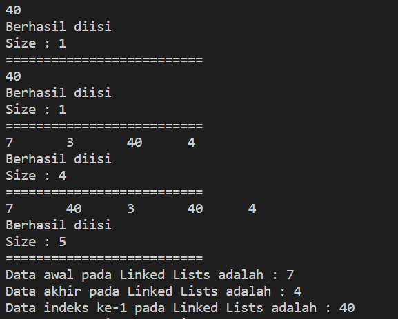

Pertanyaan

- Jelaskan method size() pada class DoublyLinkedList!

    Jawab : untuk mengembalikan jumlah elemen yang akan diperbarui jika elemen atau data itu dihapus dan ditambahkan 

- Jelaskan cara mengatur indeks pada doubly linked lists supaya dapat dimulai dari indeks ke-1!

    Jawab : pada method add lalu dengan mengatur (int i = 1) yang sebelumnya (int 1 = 0)

- Jelaskan perbedaan karakteristik fungsi Add pada doubly linked list dan single linked list!

    Jawab :pada method add dalam doubly linked list harus memperbarui dua referensi yaitu next dan prev namun untuk single linked list hanya memperbarui satu referensi yaitu next saja

- Jelaskan perbedaan logika dari kedua kode program di bawah ini!

        Kode 1
        public boolean isEmpty() {
            if(size==0) {
                return true;
            } else {
                return false;
            }
        }
        Kode 2
        public boolean isEmpty() {
            return head == null;
        }

Jawab : sama namun pada kode 2 memiliki kode program lebih singkat jika linked list kosong akan mengembalikan true, jika tidak kosong akan mengembalikan false. pada kode 1 sama halnya namun menggunakan pernyataan if/else

* ### Tugas Praktikum 1

OUTPUT :

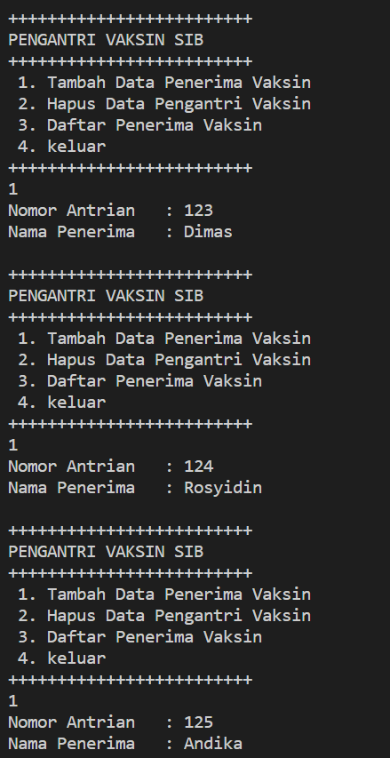

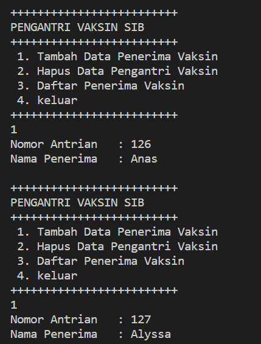

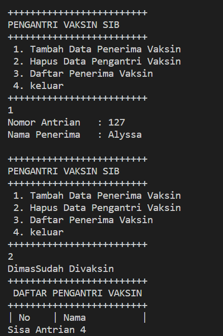

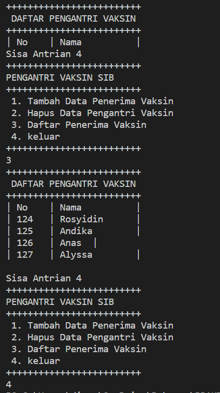

* ### Tugas Praktikum 2

OUTPUT :

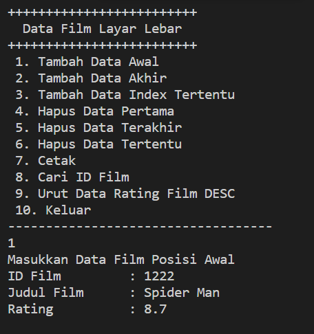

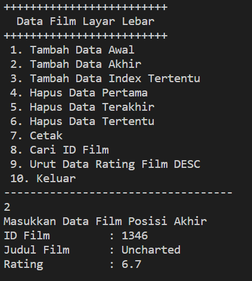

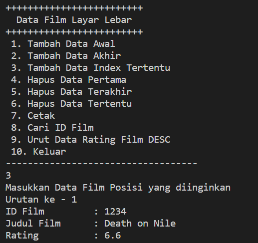

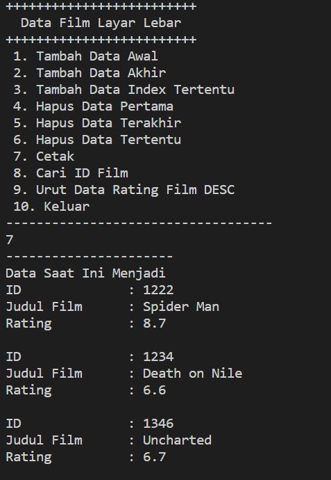

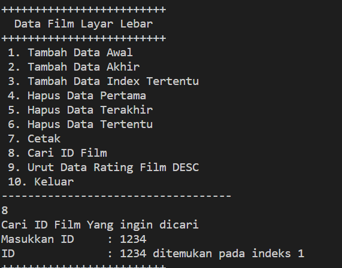
