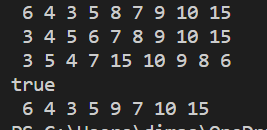
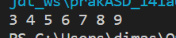
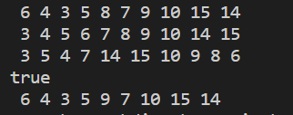
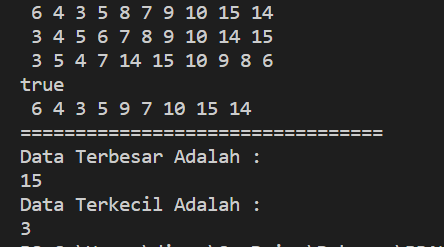
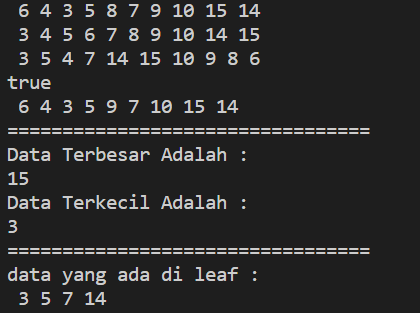
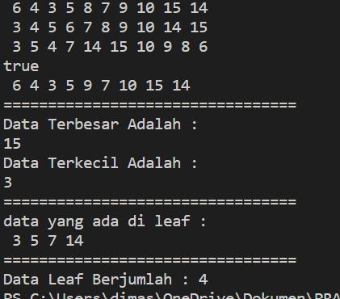
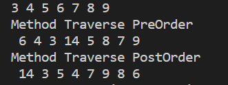

# Laporan Praktikum Pertemuan 11
## TREE
 
NAMA  : DIMAS ROSYIDIN

NIM   : 2241760054  

KELAS : 2B

PRODI : SISTEM INFORMASI BISNIS

JURUSAN : TEKNOLOGI INFORMASI

* ### Praktikum 1

OUTPUT :
- 

 

### Pertanyaan
1. Mengapa dalam binary search tree proses pencarian data bisa lebih efektif dilakukan dibanding binary tree biasa?
Jawab : Karena pada Binary Search Tree disusun secara berurutan, dengN penempatan data berdasarkan Left Child akan selalu lebih kecil dari node induk, dan right child akan selalu lebih besar dari node induk

2. Apa fungsi atribut left dan right pada class Node?
Jawab : untuk menyimpan "left child" atau nilai yang lebih kecil dari root (node induk) dan atribut right berfungsi untuk menyimpan "right child" atau nilai yang lebih besar dari root (node induk)

3. Simak pertanyaan berikut,
    1. Apa kegunaan dari atribut root di dalam class BinaryTree?
    Jawab : untuk menyimpan data yang berada pada bagian paling atas tree (root)

    2. Ketika objek tree pertama kali dibuat, apa nilai dari root?
    Jawab : ketika objek tree pertama kali dibuat nilai dari root bernilai null, karena masih belum ada data yang dimasukan

4. Ketika tree masih kosong, dan akan ditambahkan sebuah node baru, proses apa yang akan terjadi?
Jawab : akan terjadi proses add() atau penambahan data pada tree

5. Perhatikan method add(), di dalamnya terdapat baris program seperti di bawah ini. Jelaskan secara detil untuk apa baris program tersebut?

        if(data < current.data) {
        if(current.left != null) {
        current = current.left;
        } else {
            current.left = new Node(data);
            break;
        }
    }

Jawab : jika data yang dinputkan lebih kecil dari data yang sudah ada (current.data), maka atribut current akan menyimpan nilai dari current left atau current left akan menjadi induk dari data yang baru dimasukkan, dan apabila current left bersifat kosong maka data baru yang dimasukkan akan menjadi current left atau left-child

* ### Praktikum 2

OUTPUT :
- 

### Pertanyaan
1. Apakah kegunaan dari atribut data dan idxLast yang ada di class BinaryTreeArray?
Jawab : 
        - atribut data bergusngi untuk menyimpan data array
        - idx last berfusngsi untuk menyimpan batas index

2. Apakah kegunaan dari method populateData()?
Jawab : untuk menunjukkan data pada idxLast

3. Apakah kegunaan dari method traverseInOrder()?
Jawab : untuk menelusuri tree dengan metode in order dengan perinsip (left Visit Right)

4. Jika suatu node binary tree disimpan dalam array indeks 2, maka di indeks berapakah posisi left child dan rigth child masin-masing?
Jawab : jika array dimulai dari 0 maka didapati seperti ini
        - Left child = indeks ke 5
        - Right child = indeks ke 6   

5. Apa kegunaan statement int idxLast = 6 pada praktikum 2 percobaan nomor 4?
Jawab : untuk menunjukkan idxLast atau batas indeks arraynya adalah 6

* ### Tugas

1. Buat method di dalam class BinaryTree yang akan menambahkan node dengan cara rekursif.

Kode Program :

    void addNodeR(int key){
            root = addNodeR(root, key);
        }
        //SOAL NO 1
        public Node addNodeR(Node current, int data){
            if (current == null){
                return new Node(data);
            }
            if (data < current.data){
                current.left = addNodeR(current.left, data);
            }else if(data > current.data){
                current.right = addNodeR(current.right, data);
            }else{
                return current;
            }
            return current;
        }

Output :

2. Buat method di dalam class BinaryTree untuk menampilkan nilai paling kecil dan yang paling besar yang ada di dalam tree.

Kode Program :

    void maksimal(){
                Node current = root;
                while(current.right != null){
                    current = current.right;
                }
                System.out.println(current.data);
            }
            void minimal(){
                Node current = root;
                while(current.left != null){
                    current = current.left;
                }
                System.out.println(current.data);
            }

Output :

3. Buat method di dalam class BinaryTree untuk menampilkan data yang ada di leaf.

Kode Program :

        void printLeft(Node root){
                if(root == null){
                return;            
                }
                if(root.left == null && root.right == null){
                    System.out.print(" "+ root.data);
                    return;
                }if(root.left != null){
                    printLeft(root.left);
                }if(root.right != null){
                    printLeft(root.right);
                }
            }

Output :

4. Buat method di dalam class BinaryTree untuk menampilkan berapa jumlah leaf yang ada di dalam tree.

Kode Program :

    int jumlahLeft(){
                    return jumlahLeft(root);
                }
                int jumlahLeft(Node node){
                    if(node == null){
                        return 0;
                    }
                    if(node.left == null && node.right == null){
                        return 1;
                    }else{
                        return jumlahLeft(node.left)+jumlahLeft(node.right);
                    }
                }

Output :

5. Modifikasi class BinaryTreeArray, dan tambahkan : 
    1. method add(int data) untuk memasukan data ke dalam tree 
    2. method traversePreOrder() dan traversePostOrder().

Kode Program :

        public class BinaryTreeArray {
            int[] data;
            int idxLast;

            public BinaryTreeArray(){
                data = new int [10];
            }
            void populateData(int data[], int idxLast){
                this.data = data;
                this.idxLast = idxLast;
            }
            void traverseInOrder(int idxStart){
                if(idxStart <= idxLast){
                    traverseInOrder(2*idxStart+1);
                    System.out.print(data[idxStart]+" ");
                    traverseInOrder(2*idxStart+2);
                }
            }

            void add(int data){
                if(idxLast == this.data.length -1){
                    System.out.println("Tree Array sudah Penuh");
                }else{
                    this.data[++idxLast] = data;
                }
            }
            void traversePreOrder(int idxStart){
                if(idxStart <= idxLast){
                    System.out.print(" "+data[idxStart]);
                    traversePreOrder(2 * idxStart + 1);
                    traversePreOrder(2 * idxStart + 2);
                }
            }
            void traversePostOrder(int idxStart){
                if(idxStart <= idxLast){
                    traversePostOrder(2 * idxStart + 1);
                    traversePostOrder(2 * idxStart + 2);
                    System.out.print(" "+data[idxStart]);
                }
            }
        }

-----------------------------------------------------------

        public class BinaryTreeArrayMain {
            public static void main(String[] args) {
                BinaryTreeArray bta = new BinaryTreeArray();
                int [] data = {6,4,8,3,5,7,9,0,0,0};
                int idxLast = 6;
                bta.populateData(data, idxLast);
                bta.traverseInOrder(0);
            
                bta.add(14);
                System.out.println();
                System.out.println("Method Traverse PreOrder");
                bta.traversePreOrder(0);
                System.out.println();
                System.out.println("Method Traverse PostOrder");
                bta.traversePostOrder(0);
                System.out.println();
            }
        }

Output :

