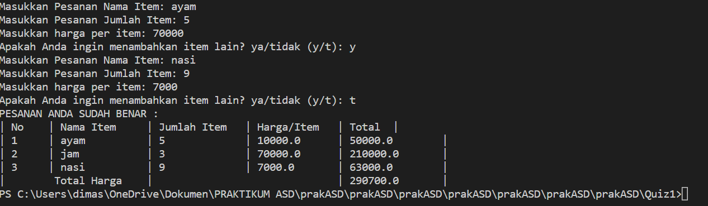

# Laporan Kuis 1

NAMA  : DIMAS ROSYIDIN

NIM   : 2241760054  

KELAS : 2B

PRODI : SISTEM INFORMASI BISNIS

JURUSAN : TEKNOLOGI INFORMASI

* ### Studi Kasus

Andi adalah seorang pemilik supermarket terbesar di Indonesia. Dia berencana untuk melakukan perbaikan proses bisnis yaitu pengadaan system kasir self-service di supermarket miliknya. Dengan adanya system ini, pelanggan bisa langsung menginputkan nama item, jumlah item, dan harga item yang dibeli. Sistem ini juga mampu mengakomodasi pembeli dari luar kota untuk bisa membeli langsung barang dari supermarket tersebut. Hasil analisis Andi menemukan bahwa dia membutuhkan programmer untuk membuatkan fitur-fitur tersebut.

* ### Requirement
1. Membuat objek dari class trnsct_123 = Transaction()
2. Membuat method
    - add_item(NamaItem, JumlahItem,  HargaPerItem) 
    - update_item_name(namaItem, updateNamaItem)
    - update_item_qty(nmITEM, updateJmlItem)                 
    - update_item_price(namaITEM, updateHrgItem)                
    - delete_item(NmItem)
    - check_order()
    - total_price()
3. Penjelasan Fungsi Fungsi dan Alur
4. Membuat Flowchart/Diagram class       

* ### OUTPUT PROGRAM :

* ### FUNGSI FUNGSI DAN ALUR :

Transaction Class:

    - Transaction(): konstruktor dengan inisialisasi array dan variabel Namaitem, itemQty, HrgItem, dan TtlItem.

    - add_item(String NamaItem, int JumlahItem, double HargaPerItem): Fungsi ini digunakan untuk menambahkan item ke transaksi. Data item (nama, jumlah, dan harga) disimpan dalam array.

    - update_item_name(String namaItem, String updateNamaItem): Fungsi ini digunakan untuk mengupdate nama item.

    - update_item_qty(String nmITEM, int updateJmlItem): Fungsi ini digunakan untuk mengupdate jumlah item.

    - update_item_price(String namaITEM, double updateHrgItem): Fungsi ini digunakan untuk mengupdate harga per item.

    - delete_item(String NmItem): Fungsi ini digunakan untuk menghapus item dari transaksi.

    - check_order(): Fungsi ini digunakan untuk memeriksa pesanan yang telah dibuat. Ini mencetak daftar item beserta jumlah, harga per item, dan total harga per item. Juga mencetak total harga pesanan.

    - total_price(): Fungsi ini menghitung total harga pesanan. Jika total harga melebihi batas tertentu, diberikan diskon sebelum mengembalikan total harga.

Main Class:

    - main(String[] args): Metode main adalah titik awal program. Program ini membuat objek Transaction yang disebut trnsct_123 dan kemudian menggunakan loop while untuk memungkinkan pengguna untuk terus menambahkan item ke transaksi.

    - Dalam loop, program mengambil input pengguna untuk nama item, jumlah item, dan harga per item, dan kemudian menggunakan method add_item untuk menambahkannya ke transaksi.

    - Setelah pengguna selesai menambahkan item, program memanggil trnsct_123.check_order() untuk memeriksa dan mencetak pesanan, termasuk total harga pesanan.

Alur program:

    - Program dimulai dengan membuat objek Transaction dan scanner untuk input pengguna.

    - Lalu memasukkan detail item yang ingin mereka, ini ditambahkan ke transaksi menggunakan method add_item.

    - Lalu ada opsi untuk menambahkan item lain "y" atau mengakhiri pesanan "t".

    - Setelah pesanan selesai, program memeriksa pesanan dan mencetak rincian pesanan serta total harga dengan diskon.

    - Program berakhir.

* ### DIAGRAM CLASS :

* ### SWAFOTO :

