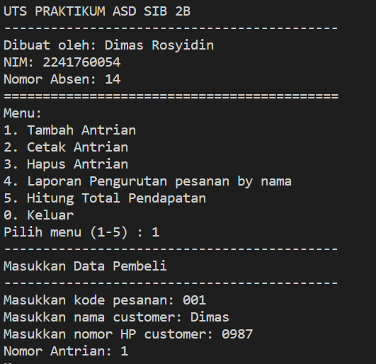
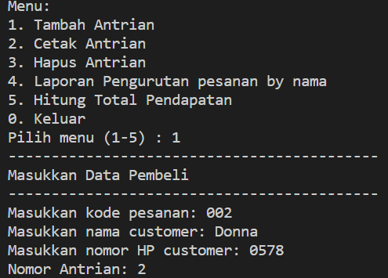
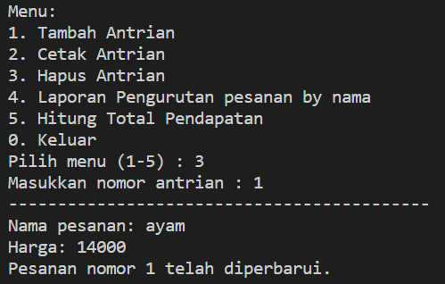
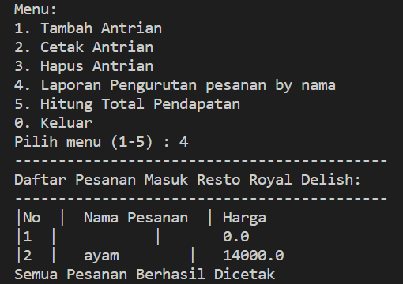
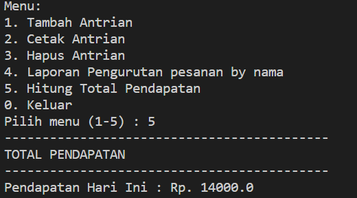

# Laporan Praktikum Ujian Tengah Semester
# Sistem Resto Royal Delish
 
NAMA  : DIMAS ROSYIDIN

NIM   : 2241760054  

KELAS : 2B

NOMOR ABSEN  : 14

PRODI : SISTEM INFORMASI BISNIS

JURUSAN : TEKNOLOGI INFORMASI

## --------------------------------

Sebuah program untuk sistem informasi Antrian pembeli pada resto Royal Delish dengan menggunakan konsep 
queue. Pada sistem informasi tersebut wajib ada kelas Pembeli dan kelas Pesanan. yang dengan ketentuan adanya menu 

1. Tambah Antrian
Pada saat dipilihan menu tambah antrian maka sistem akan menambahkan nomor antrian sesuai 
dengan urutan antrian yang ada. Kemudian sistem akan meminta inputan berupa nama pembeli, 
dan nomor hp

OUTPUT :

2. Cetak Antrian
Menu ini akan menampilkan seluruh antrian

OUTPUT :

3. Hapus Antrian
Hapus antrian harus sesuai dengan No antrian. Pada menu hapus antrian artinya pembeli telah 
menuju kasir untuk pesan makanan. Sehingga pada menu ini harus di inputkan makanan yang 
dipesan oleh pembeli.

OUTPUT :

4. Laporan pesanan (urut by Nama)
Ketika semua atrian telah habis dan resto akan tutup Menu ini akan melaporkan daftar pesanan yang 
sudah masuk dan terurut berdasarkan nama pesanan

OUTPUT :

5. Hitung total pendapatan
Ketika semua atrian telah habis dan resto akan tutup maka menu total pendapatan digunakan untuk 
menghitung keseluruhan pendapatan dari pesanan yang sudah masuk

OUTPUT :

