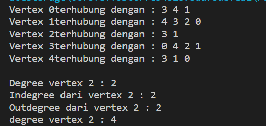
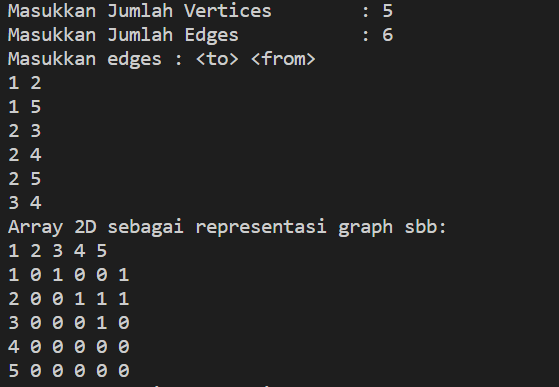
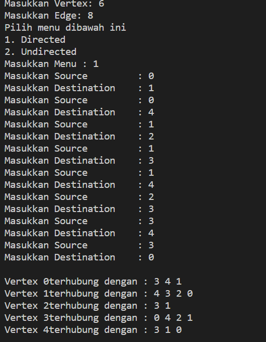
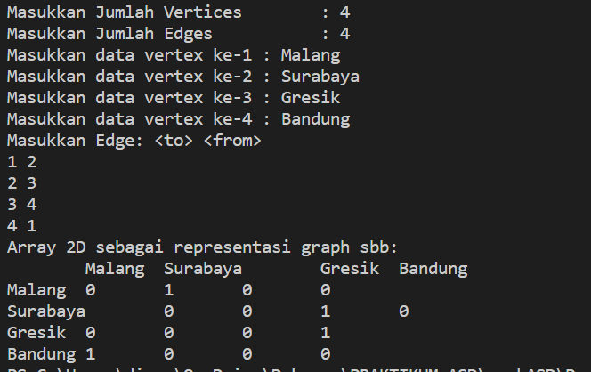
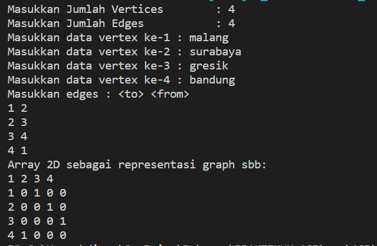

# Laporan Praktikum Pertemuan 12
## GRAPH
 
NAMA  : DIMAS ROSYIDIN

NIM   : 2241760054  

KELAS : 2B

PRODI : SISTEM INFORMASI BISNIS

JURUSAN : TEKNOLOGI INFORMASI

* ### Praktikum 1

OUTPUT :
- Hasil Runing Langkah ke -11

 

- Hasil Runing Langkah ke -13

### Pertanyaan
1. - Algoritma Prim, kegunaannya adalah mencari pohon rentang minimum untuk sebuah graf berbobot yang terhubung. Ini berarti menemukan subset dari tepi yang membentuk sebuah pohon yang mencakup etiap titik, di mana berat total semua tepi di pohon diminimalkan. Jika grafik tidak terhubung, maka ia menemukan hutan rentang minimum (pohon rentang minimum untuk setiap komponen terhubung).
- Algoritma Dijkstra, kegunaannya adalah dipakai dalam memecahkan permasalahan jarak terpendek (shortest path problem) untuk sebuah graf berarah (directed graph)
- Algoritma Warshall , kegunaannya menghitung jarak terpendek (shortest path) untuk semua pasangan titik pada sebuah graph, dan melakukannya dalam waktu berorde kubik. Algoritma warshall digunakan untuk menyelesaikan permasalahan jalur terpendek multi path
2. Untuk di Untuk memanggil fungsi linked list dan mengisi list yang berupa vertex pada linked list tersebut.
3. Untuk mengenalkan vertex tersebut dan koneksinya
4. Ketika i == destination maka akan dilihat source dari i atau dengan cara melakukan looping vertex.
5. Output tidak ada yang eror, namun vertex yang dilewati mengalami perubahan lintasan

* ### Praktikum 2

OUTPUT :
- 

 

### Pertanyaan
1. directed graph degree / derajat tidak selalu berhubungan kembali sedangkan pada undirected graph degree/derajat pasti berhubungan
2. menggunakan array dan dimulai dari 0, maka harus perlu ditambah dengan 1
3. untuk menampilkan suatu lintasan yang diperlukan
4. Directed graph : karena 1 berhubungan dengan 2 akan tetapi 2 tidak berhubungan dengan 1
5. jika terjadi eror, program dapat terus berjalan tanpa memberhentikan program sehingga meminimalisir terjadinya error atau output tidak muncul

* ### Tugas

1. 

OUTPUT :
- 

 

2. 

    public boolean graphType(int source, int destination) throws Exception{
            list[source].addFirst(destination);
            return true;
        }

OUTPUT :
- 

 

3. 

        public void removeEdge(int source, int destination) throws Exception {
            for (int i = 0; i< vertex; i++) {
                if (i == destination) {
                    list[source].remove(destination);
                }
            }
        }

    Output : tidak ada error, namun vertex yang dilewati mengalami perubahan lintasan

4. 

OUTPUT  A :
- 

 

OUTPUT  B :
- 

 