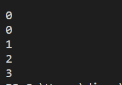
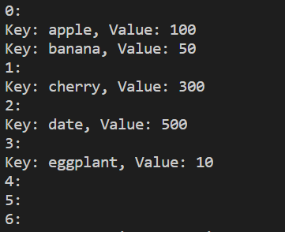
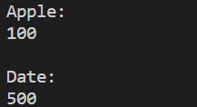
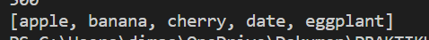
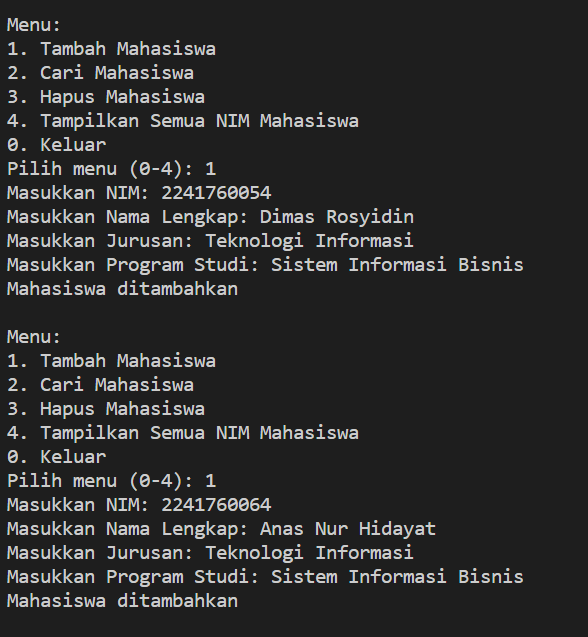
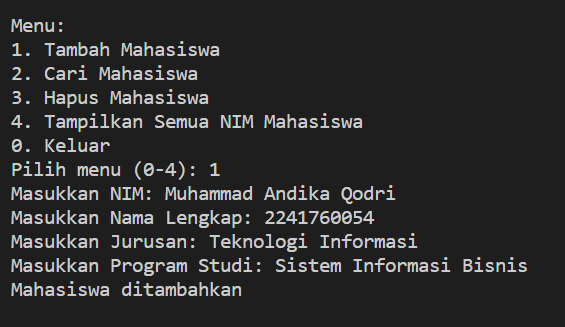
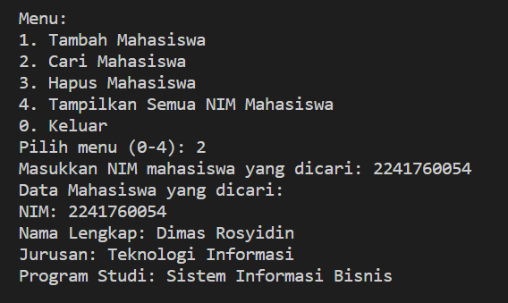
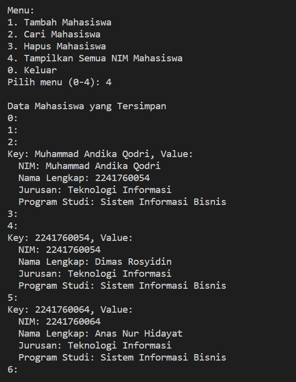
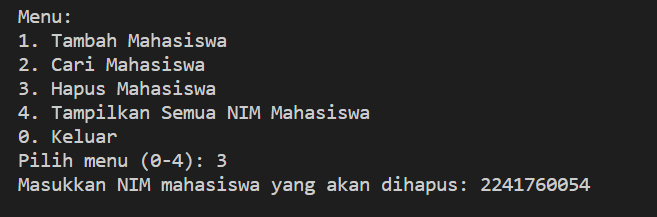
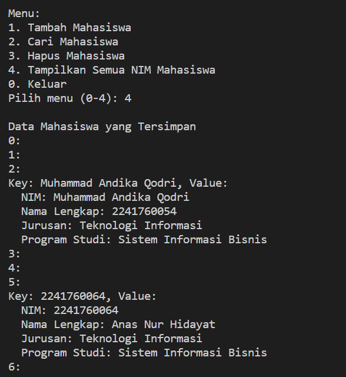

# Laporan Praktikum Pertemuan 14
## HASH TABLE
 
NAMA  : DIMAS ROSYIDIN

NIM   : 2241760054  

KELAS : 2B

PRODI : SISTEM INFORMASI BISNIS

JURUSAN : TEKNOLOGI INFORMASI

* ### Praktikum

OUTPUT :
- Hasil Running langkah ke-1

 

 - Hasil Running langkah ke-2 method set()

 

 - Hasil Running langkah ke-3 method get()

 

 - Hasil Running langkah ke-4 method keys()

 

 ### Pertanyaan
 
1. Apa keunggulan penanganan collision menggunakan metode separate chaining dibandingkan dengan motode linear probing?
Jawab : Separate Chaining:memiliki keunggulan menggunakan struktur linked list untuk menampung nilai-nilai yang memiliki hash yang sama. namun kekurangannya Memerlukan lebih banyak memori karena setiap slot harus menangani linked list terpisah.
Linear Probing:memiliki keunggulan  Menggunakan lebih sedikit memori karena hanya satu nilai yang disimpan di setiap slot, dan slot lainnya diisi berurutan jika collision terjadi.namun kekurangannya Jika ada collision, mencari slot yang tersedia bisa menjadi lebih lambat.

2. Apa maksud dari potongan kode berikut pada method hash()?

        int hash = 0;
        for (int i = 0; i < key.length(); i++) {
            hash = (hash + key.charAt(i) * i) % this.dataMap.length;
        }

Jawab : Melakukan iterasi terhadap setiap karakter dalam string key.
Untuk setiap karakter, mengupdate nilai hash dengan menjumlahkan nilai ASCII karakter dikalikan dengan posisi karakter dalam string (i).
Setelah iterasi selesai, nilai hash diambil modulo dengan panjang array this.dataMap.length untuk memastikan nilai hash berada dalam rentang yang sesuai untuk indeks array.

3. Apa maksud dari potongan kode berikut pada method set()?

        else {
            Node current = this.dataMap[hash];
            if(current.key == key) {
                current.value += value;
                return;
            }
            while (current.next != null) {
                current = current.next;
                if(current.key == key) {
                    current.value += value;
                    return;
                }
            }
            current.next = newNode;
        }

Jawab : Jika slot hash yang ditentukan tidak kosong, maka dimulai dengan mengecek node pertama dalam linked list yang terkait dengan slot tersebut.
Jika node pertama memiliki kunci yang sama dengan kunci yang baru dimasukkan (key), maka nilai value dari node tersebut diupdate dengan menambahkan nilai baru.
Jika tidak, maka iterasi dilakukan melalui linked list untuk mencari node dengan kunci yang sama. Jika ditemukan, nilai value dari node tersebut diupdate. Jika tidak ditemukan, node baru ditambahkan ke linked list.

4. Buatlah method remove() untuk menghapus data berdasarkan key.

Method Remove() :

    public void remove(String key) {
        int hash = this.hash(key);
        
        Node current = this.dataMap[hash];
        Node prev = null;
        
        while (current != null && !current.key.equals(key)) {
            prev = current;
            current = current.next;
        }
        if (current == null) {
            return;
        }
    
        if (prev == null) {
            this.dataMap[hash] = current.next;
        } else {
            prev.next = current.next;
        }

    }

Pada Main :

    table.remove("banana");
    table.printTable();

* ### Tugas

OUTPUT :
- Hasil Running Menu 1 tambah data mahasiswa

 

  

 - Hasil Running Menu 2 cari mahasiswa dengan NIM

 

  - Hasil Running Menu 4 menampilkan data NIM mahasiswa

 

  - Hasil Running Menu 3 hapus mahasiswa dengan NIM dan menu 4 menampilkan data setelah dihapus

 

 - Hasil Running Menu 4 menampilkan data setelah dihapus

 