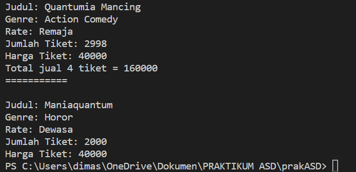
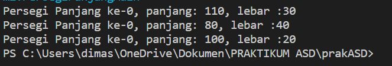
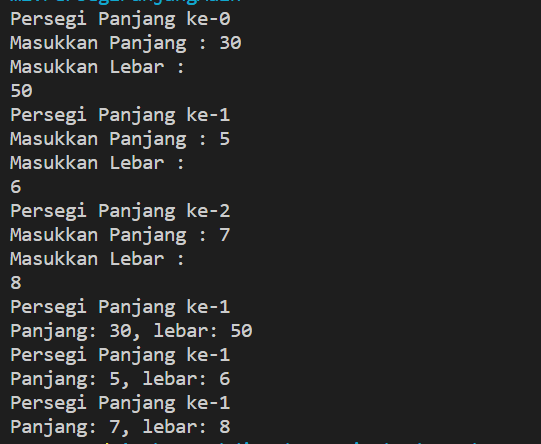
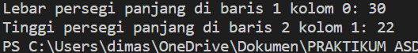
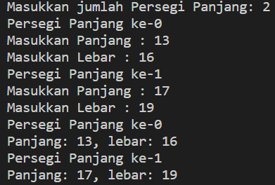
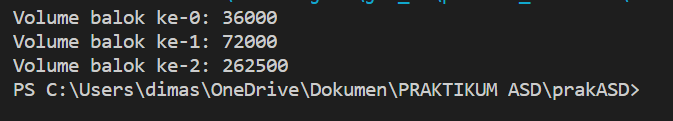
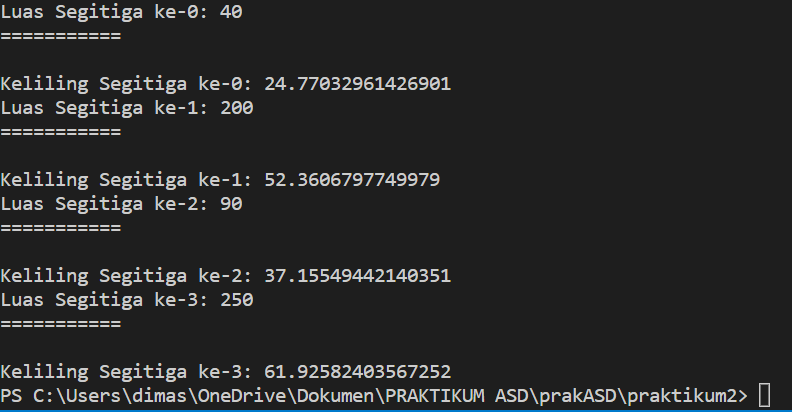
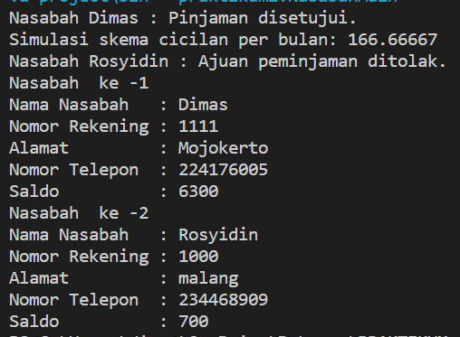

# Laporan Praktikum Pertemuan 2
JOBSHEET 2 OBJEK DAN ARRAY OF OBJEK
 
NAMA  : DIMAS ROSYIDIN

NIM   : 2241760054  

KELAS : SIB 2B

* ### FILM

OUTPUT :

2.2.3 Jawaban

1. atribut dan method
2. class Film
3.  
        String judul
        String genre
        String rate
        int jumlahTiket
        int hargaTiket
4.  
        void tampilFilm()
        void tambahTiket(int n)
        void kurangiTiket(int n)
        int totalRevenue(int jumlah)
5. 
        void kurangiTiket(int n) {

                if (jumlahTiket > 0) {
                    jumlahTiket -= n;
                } else {
                    System.out.println("Tiket tidak tersedia.");
                }
            }
6. agar kita dapat menentukan jumlah tiket yang akan ditambahkan ke stok film tersebut dengan bilangan bulat
7. untuk menghitung total pendapatan yang diperoleh dari penjualan yang memiliki bilangan bulat
8. untuk mengubah nilai atribut jumlahTiket dalam objek Film dan tidak menghasilkan nilai yang perlu dikembalikan

2.3.3 Jawaban

1. 
        Film film1 = new Film();
2. untuk mengakses atribut :

        film1.judul = "Quantumia Mancing";
        film1.genre = "Action Comedy";
        film1.rate = "Remaja";
        film1.jumlahTiket = 3000;
        film1.hargaTiket = 40000;

    untuk mengakes method :

        film1.tambahTiket(1);
        film1.kurangiTiket(3);
        film1.tampilFilm();

2.4.3 Jawaban

1. pada baris 10 :

            Film(String jd, String gr, String rt, int jt, int ht){

                judul = jd;
                genre = gr;
                rate = rt;
                jumlahTiket = jt;
                hargaTiket = ht;
            }
2. deklarasi konstruktor berparameter
3. tidak bisa

* ### PERSEGI PANJANG

OUTPUT :

* Sebelum DI Modifikasi

* Sesudah DI Modifikasi

2.5.3 Jawaban 

1. tidak, karena class dapat memiliki atribut saja dan method sesuai dengan kebutuhan
2. karena menggunakan konstruktor default jadi pemanggilan konstruktor default akan tetap digunakan untuk membuat objek baru.
3. instansiasi array of object
4. instansiasai dan inisialisasi pada index ke 1
5. karena mengunakan PBO yaitu class main sebagai object, dan class persegi panjang adalah template atau rancangan untuk membuat object

2.6.3 Jawaban

1. bisa
2. 
        public class psgpanjang {
        
                int lebar;
                int tinggi;
            
                public psgpanjang(int lebar, int tinggi) {
                    this.lebar = lebar;
                    this.tinggi = tinggi;
                }
            }
            
        public class psgpanjangMain {
            
            public static void main(String[] args) {
            
                psgpanjang[][] dataPsgpanjang = new psgpanjang[1][2];

                dataPsgpanjang[0][0] = new psgpanjang(30, 20);
                dataPsgpanjang[0][1] = new psgpanjang(50, 22);
            

                System.out.println("Lebar persegi panjang di baris 1 kolom 0: " + dataPsgpanjang[0][0].lebar);
                System.out.println("Tinggi persegi panjang di baris 2 kolom 1: " + dataPsgpanjang[0][1].tinggi);
            }
        }

output :

3. karena saat mengakses sisi belum membuat objek baru jadi perlu inisialisasi pada pada index 5 di objek persegi pada array "ppArray" 

4. 
        public class PersegiPanjangMain {
            public static void main(String[] args) {
                Scanner sc = new Scanner(System.in);

                System.out.print("Masukkan jumlah Persegi Panjang: ");
                int jumlahPersegiPanjang = sc.nextInt();
                PersegiPanjang[] ppArray = new PersegiPanjang[jumlahPersegiPanjang];

                for(int i = 0; i<jumlahPersegiPanjang ; i++){
                    ppArray[i] = new PersegiPanjang();
                    System.out.println("Persegi Panjang ke-" + i);
                    System.out.print("Masukkan Panjang : ");
                    ppArray[i].panjang = sc.nextInt();
                    System.out.print("Masukkan Lebar : ");
                    ppArray[i].lebar = sc.nextInt();
                }

                for(int i = 0; i<jumlahPersegiPanjang ; i++){
                    System.out.println("Persegi Panjang ke-"+ 1);
                    System.out.println("Panjang: " + ppArray[i].panjang + ", lebar: " + ppArray[i].lebar);
                }

            }
        }

    OUTPUT :

    

5. tidak, karena jika terjadi duplikasi maka nilai dari objek tersebut tidak memiliki arah atau salah satu nilai objek akan tergantikan

* ### BALOK

OUTPUT :

2.7.3 Jawaban

1. konstruktor tanpa parameter :

        public Segitiga() {
                alas = 0;
                tinggi = 0;
                sisiMiring = 0;
            }
    kontruktor dengan parameter : 

            public Segitiga (int a , int t){
                alas = a;
                tinggi = t;
                sisiMiring = Math.sqrt(a * a + t * t);
            }
2. 
        public class Segitiga {

            Scanner sc = new Scanner(System.in);
            public int alas;
            public int tinggi;
            public double sisiMiring;
            public Segitiga (int a , int t) {
                alas = a;
                tinggi = t;
                sisiMiring = Math.sqrt(a * a + t * t);
                }
        }
3. 
        public int hitungLuas(){

                return alas * tinggi ;
            }
            public double hitungKeliling(){
                
                return alas + tinggi + sisiMiring;

            }
4.
        public class SegitigaMain {
            
            public static void main(String[] args) {

                Segitiga[] sgarray = new Segitiga [4];
                sgarray [0] = new Segitiga (10, 4);
                sgarray [1] = new Segitiga (20, 10);
                sgarray [2] = new Segitiga (15, 6);
                sgarray [3] = new Segitiga (25, 10);
                
                for (int i = 0; i< 4 ; i++)
                {
                    System.out.println("Luas Segitiga ke-" + i + ": " + sgarray[i].hitungLuas());
                    System.out.println("===========\n");
                    System.out.println("Keliling Segitiga ke-" + i + ": " + sgarray[i].hitungKeliling());

                }
            }
        }

    OUTPUT : 
    

* ### TUGAS PRAKTIKUM 
 OUTPUT : 
    