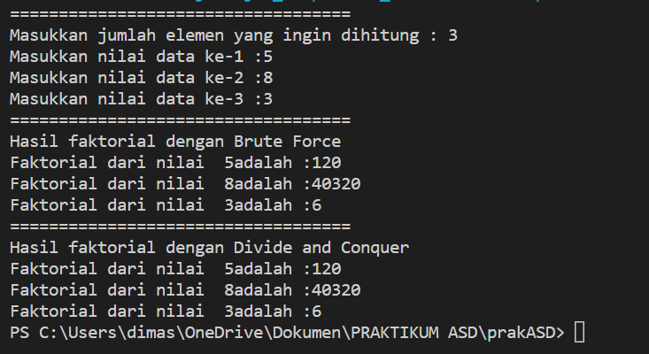
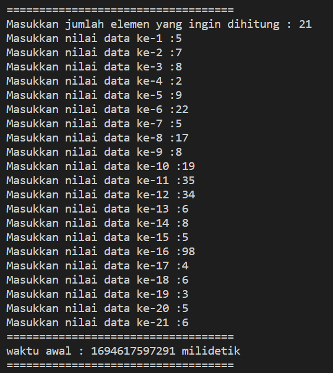
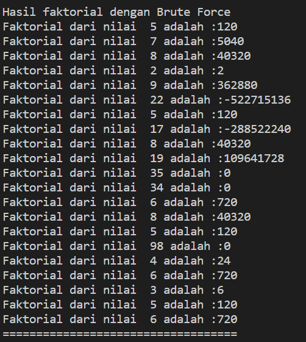
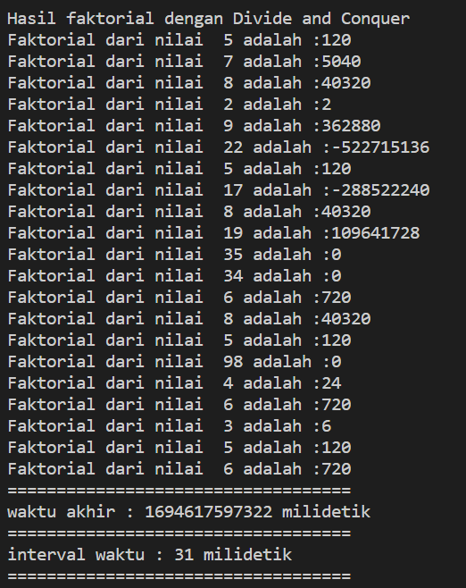
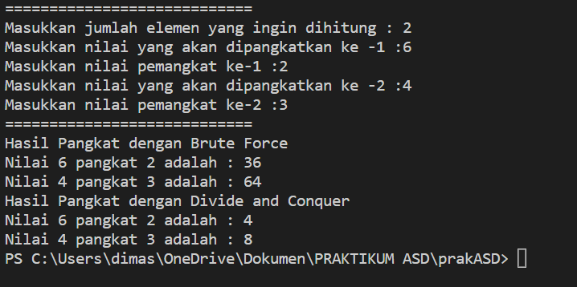
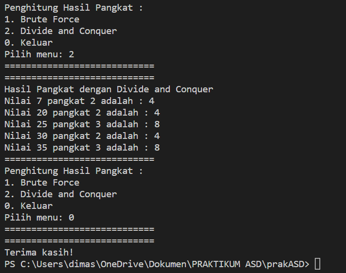
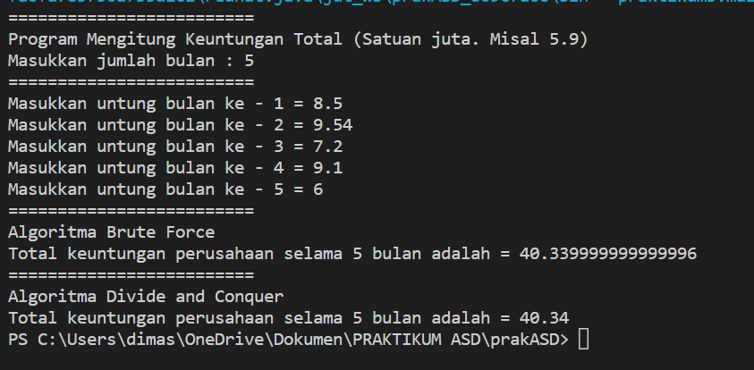
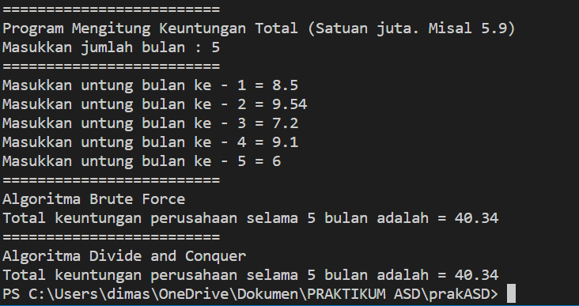
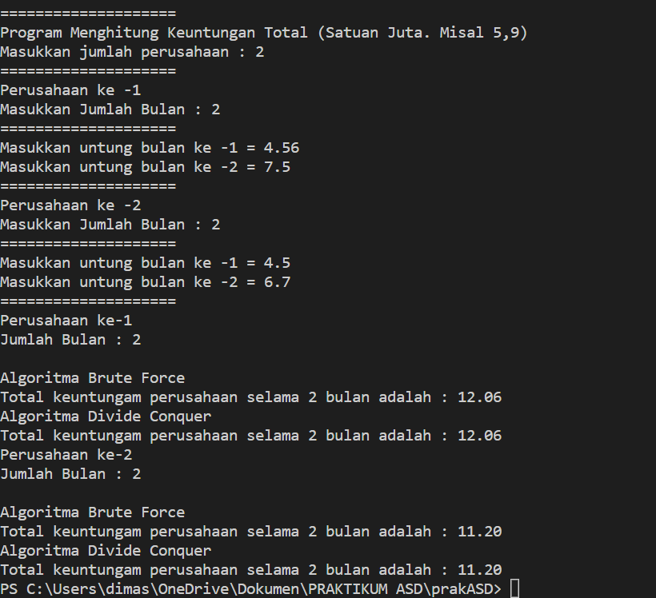
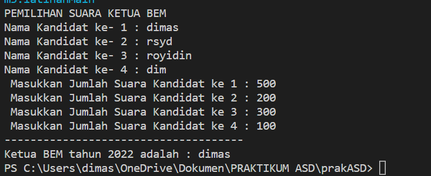

# Laporan Praktikum Pertemuan 3
JOBSHEET IV BRUTE FORCE DAN DIVIDE CONQUER
 
NAMA  : DIMAS ROSYIDIN

NIM   : 2241760054  

KELAS : 2B

PRODI : SISTEM INFORMASI BISNIS

JURUSAN : TEKNOLOGI INFORMASI

* ### FAKTORIAL 

OUTPUT :

4.2.3 Jawaban

1. penggunaan pemilihan if(n==1) return 1; artinya jika nilai yang dimasukkan nantinya adalah 1 maka hasil yang akan ditampilkan oleh program main nantinya adalah 1 dan berfungsi sebagai batas dari devide conquer dimana perulangan akan berakhir saat n sudah sama dengan 1
2.  - Divide : membagi masalah dengan mengurangi nilai n hingga mencapai base case n == 1.
    - Conquer : menghitung faktorial secara berurutan dengan mengalikan nilai n dengan hasil rekursi dari FaktorialDC(n-1)
    - Combine : menggabungkan solusi masing-masing masalah sehingga membentuk solusi masalah semula
3.  bisa, menggunakan perulangan while. yang merubah perulangan for pada method FaktorialBF(int n)

        public int FaktorialBF(int n){
            int fakto = 1;
            int i =1;
            while (i <= n) {
                fakto = fakto * i;
                i++;
            }
            return fakto;
        }
4.  Pengecekan waktu awal :

        long awal = System.currentTimeMillis();
        System.out.println("waktu awal : " + String.valueOf(awal)+ " milidetik");

    Pengecekan waktu akhir :

        long akhir = System.currentTimeMillis();
        System.out.println("waktu akhir : " + String.valueOf(akhir)+ " milidetik");

    Pengecekan interval waktu :

        long interval = akhir - awal;
        System.out.println("interval waktu : " + String.valueOf(interval)+ " milidetik");
        
5. Output : 
    

* ### PANGKAT 

OUTPUT :

4.3.3 Jawaban

1. -    method pangkatBF() mencari hitung hasil pangkat dilakukan dengan cara bruteforce yang dilakukan dengan looping dan algoritma bruteforce nya adalah mendeklarasikan dahulu hasil = 1 lalu melakukan perulangan dengan batas n(pangkatnya) dan dalam perulangan tersebut dilakukan looping dari hasil tadi di kali dengan a (bilangan yang akan dipangkat) dan perulangan akan terus berlanjut hingga < n sehingga a akan menghasilkan nilai hasil dari pemangkatnya.
    - method pangkatDC() mencari hitung hasil pangkat dilakukan dengan cara divide conqquer yang dilakukan dengan rekursif dan algoritma divide conquer yang dilakukan terbagi dalam 3 tahapan yaitu : Divide, Conquer, Combine
2. - jika n(pangkat bilangan) dimodulus 2 hasilnya adalah 1 maka returnya hasil dari (pangkatDC(a,n/2)*pangkatDC(a,n/2)*a) karena bilangan pangkatnya adalah ganjil
    - jika n(pangkat bilangan) dimodulus 2 hasilnya adalah tidak sama dengan 1 maka returnnya hasil dari (pangkatDC(a,n/2)*pangkatDC(a,n/2)) karena bilangan pangkatnya adalah genap
3. Sudah termasuk, Tahap Combine ditunjukkan pada sintaks return untuk pengembalian nilai dimana hasil conquer dilakukan pemanggilan hasil dari bilangan berpangkat 
4. Ditambahkan pada class pangkat

        public pangkat(int nilai, int pangkat) {
        this.nilai = nilai;
        this.pangkat = pangkat;
    }
5. Output dari modifikasi penambahan menu untuk salah satu method  
    

* ### SUM 

OUTPUT :

4.4.3 Jawaban

1.  - TotalBF() :  fungsi looping untuk melakukan penjumlahan semua elemen array[i], seperti pada output yaitu (8.5 + 9.54 + 7.2 + 9.1 + 6 = 40.33)
    - TotalDC() : memecah array menjadi dua bagian, menghitung total dari masing-masing bagian, dan kemudian menggabungkan kembali hasilnya, seperti pada output yaitu (8.5 + 9.54) + (7.2 + 9.1 + 6) = 40.34
2. ditambahan %.2f

        System.out.printf("Total keuntungan perusahaan selama " + sm.elemen + " bulan adalah = %.2f" ,sm.totalBF(sm.keuntungan));
        System.out.println("=========================");
        System.out.println("Algoritma Divide and Conquer");
        System.out.printf("Total keuntungan perusahaan selama " + sm.elemen + " bulan adalah = %.2f" ,sm.totalDC(sm.keuntungan, 0,sm.elemen-1));

    Output : 
    
3.  menggabungkan total dari kedua bagian yang lebih kecil (lsum dan rsum) dengan elemen tengah (arr[mid]) untuk menghasilkan total keseluruhan.
4. karena method totalDC() untuk membagi bagiannya menjadi left(l), dan right(r). jadi variabel mid untuk perhitungan semua bagian tengahnya
5. Output : 

* ### LATIHAN PRAKTIKUM
Output : 

    