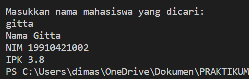
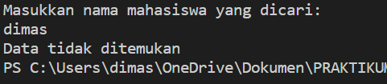
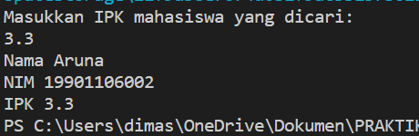
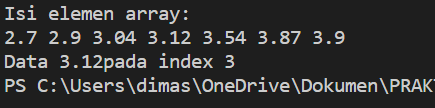
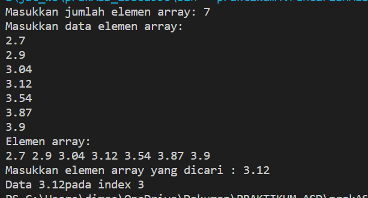
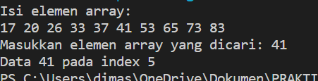
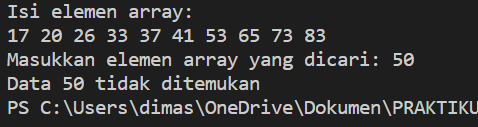
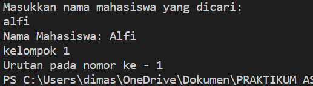
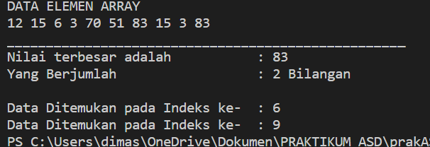
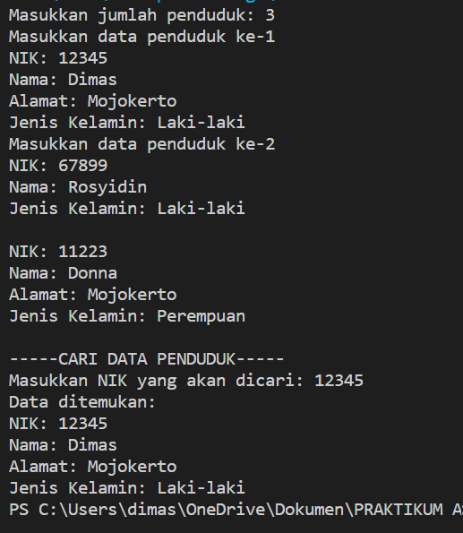

# Laporan Praktikum Pertemuan 4
JOBSHEET SEARCHING
 
NAMA  : DIMAS ROSYIDIN

NIM   : 2241760054  

KELAS : 2B

PRODI : SISTEM INFORMASI BISNIS

JURUSAN : TEKNOLOGI INFORMASI

* ### UNORDERED SEQUENTIAL SEACRH 

OUTPUT :

4.2.3 Jawaban

1.      if (cari.equalsIgnoreCase(mhs[i].namaMahasiswa))
    fungsi dari kode program diatas adalah untuk tidak ada perbedaan antara huruf besar (kapital) dengan huruf kecil

2.  dengan menambahkan kode program 

        System.out.println ("Data tidak ditemukan");
        return;

    OUTPUT : 
    

3. kode program 

        Double cari = sc.nextDouble();
        for (int i = 0; i < mhs.length; i++) {
        if (cari.equals(mhs[i].ipk)) {

    OUTPUT : 
     

* ### ORDERED SEARCH 

OUTPUT :

4.3.3 Jawaban

1.       OrderedSearch os= new OrderedSearch (data);

    fungsi dari kode program diatas adalah untuk membuat objek baru yaitu “os” dari class “orderedSearch” yang berisikan data pada “data"

2. pada break pertama menghentikan perulangan untuk menyamakan data atau mencari 
data di index keberapa. Pada break yang kedua menghentikan perulangan untuk mengurutkan 
dari yang terkecil

3. OUTPUT MODIFIKASI : 

* ### TUGAS

1. OUTPUT A : 

x = 41. menggunakan ordered search

   OUTPUT B :
   
   x = 50, menggunakan ordered search 

2.  OUTPUT : 

3.  OUTPUT : 

4.  OUTPUT : 
