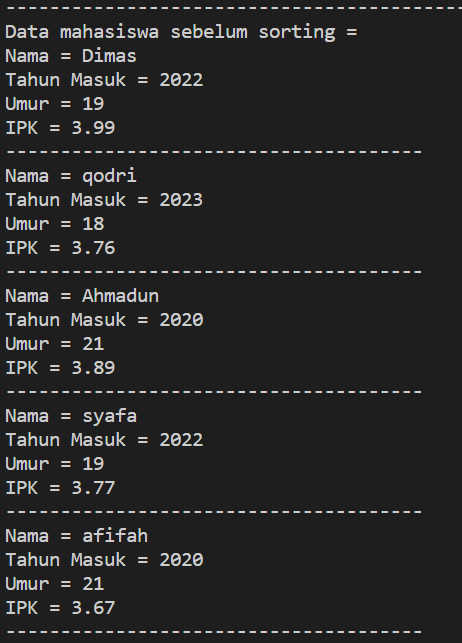
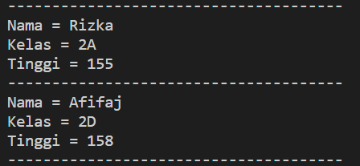

# Laporan Praktikum Pertemuan 5
SORTING (BUBBLE SORT DAN SELECTION SORT)
 
NAMA  : DIMAS ROSYIDIN

NIM   : 2241760054  

KELAS : 2B

PRODI : SISTEM INFORMASI BISNIS

JURUSAN : TEKNOLOGI INFORMASI

* ### BUBBLE SORT

KODE PROGRAM PADA CLASS Sort : 

    package praktikum5;

    public class Sort {
    public int [] data;
    public int jumData;

    public Sort(int Data[], int jmlData){
        jumData=jmlData;
        data=new int[jmlData];
        for (int i=0; i<jumData; i++){
            data[i]=Data[i];
        }
    }

    void bubblesort(){
        int temp=0;
        for (int i=0; i<jumData-1; i++){
            for (int j=1; j<(jumData-i); j++){
                if (data[j-1] >data[j]){
                    temp=data[j];
                    data[j]=data[j-1];
                    data[j-1]=temp;
                }
            }
        }
    }

    public void tampilData(){
        for (int i=0; i<jumData; i++){
            System.out.print(data[i] + " ");
    }
    System.out.println();
    
}
}

KODE PROGRAM PADA CLASS Main :

    public class Main {
    public static void main(String[] args) {
        int a[] = {15, 10, 7, 22, 5};
        Sort urut = new Sort(a, a.length);
        System.out.println("Data sebelum urut " );
        urut.tampilData();
      
    }
}

OUTPUT :
- memanggil method tampildata dan bubblesort

* ### SELECTION SORT

KODE PROGRAM :

Ditambahkan pada class Sort 

    void selectionSort(){
        for (int i=0; i<jumData-1; i++){
            int min=i;
            for (int j=i+1; j<jumData; j++){
                if (data[j] >data[min]){
                    min=j;
                }
            }
            int temp=data[i];
            data[i]=data[min];
            data[min]=temp;
    }
}

KODE PROGRAM : 
Ditambahkan pada class Main 

        System.out.println("Data sesudah urut Bubble Sort (ASC)");
        urut.bubblesort();
        urut.tampilData();

OUTPUT :
- memanggil method tampildata, bubblesort dan selectionsort

5.2.4 Jawaban

1. - Sort urut: deklarasi dan inisialisasi objek urut dari kelas Sort

- new Sort(a, a.length): pembuatan objek yang menggunakan konstruktor kelas Sort. dengan parameter, array a dan panjangnya a.length

2.  untuk melakukan pertukaran (swap) antara dua elemen dalam array dan untuk memindahkan elemen-elemen yang belum terurut
3.     void selectionSort(){
        for (int i=0; i<jumData-1; i++){
            int min=i;
            for (int j=i+1; j<jumData; j++){
                if (data[j] >data[min]){
                    min=j;
                }
            }
            int temp=data[i];
            data[i]=data[min];
            data[min]=temp;
        }
        }
4. OUTPUT : bubblesort dan selectionsort secara descending

* ### ARRAY OF OBJEK

KODE PROGRAM PADA CLASS Mahasiswa :

    package praktikum5;

    public class Mahasiswa {
    String nama;
    int thnMasuk, umur;
    double ipk;

    Mahasiswa(String n, int t, int u, double i){
        nama = n;
        thnMasuk = t;
        umur = u;
        ipk = i;
    }

    void tampil(){
        System.out.println("Nama = " + nama);
        System.out.println("Tahun Masuk = "+ thnMasuk);
        System.out.println("Umur = " + umur);
        System.out.println("IPK = " + ipk);
    }
    }

KODE PROGRAM PADA CLASS DaftarMhsiswaBerprestasi :

    package praktikum5;

    public class DaftarMhasiswaBerprestasi {
    Mahasiswa lisMhs[] = new Mahasiswa[5];
    int idx;

    void tambah(Mahasiswa m){
        if(idx<lisMhs.length){
            lisMhs[idx] = m;
            idx++;
        }else{
            System.out.println("Data sudah penuh!!");
        }
    }

    void tampil(){
        for(Mahasiswa m : lisMhs){
            m.tampil();
            System.out.println("--------------------------------------");
        }
    }

    void bubbleSort(){
        for(int i = 0 ; i<lisMhs.length; i++){
            for(int j=1; j<lisMhs.length-i; j++){
                if(lisMhs[j].ipk>lisMhs[j-1].ipk){
                    Mahasiswa tmp = lisMhs[j];
                    lisMhs[j] = lisMhs[j-1];
                    lisMhs[j-1] = tmp;
                }
            }
        }
    }
    }

KODE PROGRAM PADA CLASS Mainmhs : 

    package praktikum5;
    import java.util.Scanner;
    public class Mainmhs {
    public static void main(String[] args) {
        Scanner s = new Scanner(System.in);
        Scanner s1 = new Scanner(System.in);
        DaftarMhasiswaBerprestasi data = new DaftarMhasiswaBerprestasi();
        int jumMhs= 5;
        for (int i =0; i<jumMhs;i++){
            System.out.print("Nama = ");
            String nama = s1.nextLine();
            System.out.print("Tahun Masuk = ");
            int thn = s.nextInt();
            System.out.print("Umur = ");
            int umur = s.nextInt();
            System.out.print("IPK = ");
            double ipk = s.nextDouble();

            Mahasiswa m = new Mahasiswa(nama, thn, umur, ipk);
            data.tambah(m);
        }

        System.out.println("-------------------------------------------");
        System.out.println("Data mahasiswa sebelum sorting = ");
        data.tampil();

        System.out.println("Data mahasiswa setelah sorting desc berdasar ipk = ");
        data.bubbleSort();
        data.tampil();
    }
    }

OUTPUT :
- input data mahasiswa

- data mahasiswa sebelum disorting

- data mahasiswa sesudah disorting secara desc menggunakan bubblesort

- data mahasiswa sesudah disorting secara asc menggunakan selectionsort

5.3.6 Jawaban

1.  KODE PROGRAM 

        void selectionSort(){
        for (int i=0; i<lisMhs.length-1; i++){
            int idxmin=i;
            for (int j=i+1; j<lisMhs.length; j++){
                if (lisMhs[j].ipk > lisMhs[idxmin].ipk){
                    idxmin=j;
                }
            }
            Mahasiswa tmp = lisMhs[idxmin];
            lisMhs[idxmin] = lisMhs[idxmin];
            lisMhs[i] = tmp;
        }
        }

- (for (int i=0; i<lisMhs.length-1; i++)): mengontrol iterasi melalui elemen-elemen array yang akan diurutkan.  lisMhs - 1, elemen terkecil akan ditemukan dan ditempatkan pada posisi array.

- idxmin : menyimpan indeks dari elemen dengan IPK terbesar yang ditemukan selama pencarian dalam loop

- (for (int j=i+1; j<lisMhs.length; j++)): mencari nilai IPK terbesar di antara elemen-elemen yang belum diurutkan. 

- jika IPK dari lisMhs[j] lebih besar dari IPK dari lisMhs[idxmin], maka idxmin diperbarui dengan nilai j, yang berarti elemen lisMhs[j] memiliki IPK yang lebih besar.

2. - Bubble Sort: Pertukaran nilai (swap) terjadi setiap kali dua elemen yang tidak terurut berdekatan ditemukan. Selama iterasi, jika elemen ke-j memiliki IPK lebih besar dari elemen ke-(j+1), maka kedua elemen tersebut akan ditukar posisinya.
- Selection Sort: Pertukaran nilai terjadi hanya satu kali dalam satu iterasi. Setelah mencari nilai minimum, nilai minimum tersebut ditukar dengan elemen pada indeks i (elemen pertama yang belum diurutkan). Ini terjadi setelah selesai iterasi dalam.
3.  untuk mengurutkan secara descending berdasarkan nilai IPK. Jika elemen berikutnya memiliki IPK yang lebih besar, maka posisi keduanya ditukar sehingga elemen dengan IPK tertinggi akan bergerak ke posisi terdepan pada setiap iterasi. Ini adalah langkah kunci dalam algoritma Bubble Sort untuk menghasilkan array yang terurut
4. a. 
- Perulangan i (loop luar) untuk mengontrol iterasi seluruh proses Bubble Sort. Setiap iterasi dari perulangan i akan memindahkan elemen terbesar ke posisi akhir array

- Perulangan j (loop dalam) untuk membandingkan dan menukar elemen-elemen yang berdekatan dalam array. Perulangan j mengontrol berapa kali perbandingan dan pertukaran elemen akan terjadi dalam satu iterasi i.

b. Syarat dari perulangan i adalah i < lisMhs.length-1 karena selama satu iterasi terakhir dari perulangan i, hanya satu elemen yang belum diurutkan yang akan tetap di tempatnya, yaitu elemen terkecil yang akan berada di posisi awal array. 

c. Syarat dari perulangan j adalah j < lisMhs.length-i karena selama setiap iterasi i, elemen dengan nilai IPK terbesar akan ke posisi terakhir, dan elemen terbesar tersebut tidak perlu lagi dibandingkan dan hanya elemen-elemen yang belum diurutkan yang harus dibandingkan dan ditukar

d. Jika banyak data dalam listMhs adalah 50, maka perulangan i akan berlangsung sebanyak 49 kali. dan ada 49 tahap Bubble Sort yang ditempuh untuk mengurutkan data tersebut

5.  untuk mencari indeks dari elemen dengan IPK terbesar

* ### TUGAS

1. KODE PROGRAM PADA CLASS Paskibraka : 

        package praktikum5;

        public class Paskibraka {
            String nama;
            String kelas;
            int tinggi;

            Paskibraka (String nama, String kelas, int tinggi){
                this.nama=nama;
                this.kelas=kelas;
                this.tinggi=tinggi;
            }

            void tampil(){
                System.out.println("Nama = " + nama);
                System.out.println("Kelas = "+ kelas);
                System.out.println("Tinggi = " + tinggi);
            }
        }

KODE PROGRAM PADA CLASS DaftarAnggotaPaskibraka : 

        package praktikum5;

        public class DaftarAnggotaPaskibraka {
            Paskibraka listPeserta[] = new Paskibraka[10];
            int id;

            void tambah(Paskibraka p){
                if(id<listPeserta.length){
                    listPeserta[id] = p;
                    id++;
                }else{
                    System.out.println("Data sudah penuh!!");
                }
            }

            void tampil(){
                for(Paskibraka p : listPeserta){
                    p.tampil();
                    System.out.println("--------------------------------------");
                }

        
        }
        void Sorting(){
            for(int i = 0 ; i<listPeserta.length; i++){
                for(int j=1; j<listPeserta.length-i; j++){
                    if(listPeserta[j].tinggi>listPeserta[j-1].tinggi){
                        Paskibraka tmp = listPeserta[j];
                        listPeserta[j] = listPeserta[j-1];
                        listPeserta[j-1] = tmp;
                    }
                }
            }
        }
        }

KODE PROGRAM PADA CLASS MainPaskib : 

        package praktikum5;
        import java.util.Scanner;
        public class MainPaskib {
            public static void main(String[] args) {
                Scanner s = new Scanner(System.in);
                Scanner s1 = new Scanner(System.in);
                DaftarAnggotaPaskibraka data = new DaftarAnggotaPaskibraka();
                int jumMhs= 10;
                for (int i =0; i<jumMhs;i++){
                    System.out.print("Nama = ");
                    String nama = s1.nextLine();
                    System.out.print("Kelas = ");
                    String kelas = s1.nextLine();
                    System.out.print("Tinggi = ");
                    int tinggi = s.nextInt();
                    s.nextLine();
                    System.out.println();

                    Paskibraka p = new Paskibraka(nama, kelas, tinggi);
                    data.tambah(p);
                }

                System.out.println("-------------------------------------------");
                System.out.println("Data paskibraka sebelum sorting = ");
                data.tampil();

                System.out.println("Data paskibraka setelah sorting desc berdasarkan Tinggi ");
                data.Sorting();
                data.tampil();
            }
            
        }

OUTPUT :
- input data paskibraka

- data paskibraka sebelum disorting

- data paskibraka sesudah disorting

2. Modifikasi program untuk lolos seleksi dengan ketentuan tinggi badan minimal 170cm
- dengan menambahkan if (p != null && p.tinggi > 170) pada method tampil

OUTPUT : 
- input data paskibraka

- data paskibraka sebelum disorting dan sesudah disorting sesuai ketentuan 

3. KODE PROGRAM PADA CLASS Buku : 

        package praktikum5;

        public class Buku {
            String judul;
            int jumlahHalaman;
            double ukuranBuku;

            Buku(String judul, int jumlahHalaman, double ukuranBuku){
                this.judul=judul;
                this.jumlahHalaman=jumlahHalaman;
                this.ukuranBuku=ukuranBuku;
            }
        }

KODE PROGRAM PADA CLASS PengurutanBuku : 

        package praktikum5;

        public class PengurutanBuku {
            public Buku[] data;
            public int jumData;

            public PengurutanBuku(Buku[] Data, int jmlData) {
                jumData = jmlData;
                data = new Buku[jmlData];
                for (int i = 0; i < jumData; i++) {
                    data[i] = Data[i];
                }
            }

            void bubblesort(String kolom) {
                for (int i = 0; i < jumData - 1; i++) {
                    for (int j = 0; j < jumData - i - 1; j++) {
                        if (kolom.equals("UkuranBuku")) {
                            if (data[j].ukuranBuku > data[j + 1].ukuranBuku) {
                                Buku temp = data[j];
                                data[j] = data[j + 1];
                                data[j + 1] = temp;
                            }
                        } else if (kolom.equals("JumlahHalaman")) {
                            if (data[j].jumlahHalaman > data[j + 1].jumlahHalaman) {
                                Buku temp = data[j];
                                data[j] = data[j + 1];
                                data[j + 1] = temp;
                            }
                        }
                    }
                }
            }

            void selectionSort(String kolom) {
                for (int i = 0; i < jumData - 1; i++) {
                    int min = i;
                    for (int j = i + 1; j < jumData; j++) {
                        if (kolom.equals("UkuranBuku")) {
                            if (data[j].ukuranBuku < data[min].ukuranBuku) {
                                min = j;
                            }
                        } else if (kolom.equals("JumlahHalaman")) {
                            if (data[j].jumlahHalaman < data[min].jumlahHalaman) {
                                min = j;
                            }
                        }
                    }
                    Buku temp = data[i];
                    data[i] = data[min];
                    data[min] = temp;
                }
            }

            void tampilData() {
                for (int i = 0; i < jumData; i++) {
                    System.out.println("Judul Buku = " + data[i].judul);
                    System.out.println("Jumlah Halaman = " + data[i].jumlahHalaman);
                    System.out.println("Ukuran Buku (cm) = " + data[i].ukuranBuku);
                    System.out.println();
                }
            }
        }

KODE PROGRAM PADA CLASS MainBuku : 

        package praktikum5;

        public class MainBuku {
            public static void main(String[] args) {
                Buku[] dataBuku = new Buku[4];
                dataBuku[0] = new Buku("Algoritma Pemrograman", 1292, 25);
                dataBuku[1] = new Buku("Basis data", 400, 35);
                dataBuku[2] = new Buku("Dasar Pemrograman", 294, 29.7);
                dataBuku[3] = new Buku("Rekayasa Perangkat Lunak", 824, 70.7);

                PengurutanBuku urutUkuran = new PengurutanBuku(dataBuku, dataBuku.length);
                PengurutanBuku urutHalaman = new PengurutanBuku(dataBuku, dataBuku.length);

                System.out.println("Data Buku Sebelum Sorting:");
                urutUkuran.tampilData();
                urutUkuran.bubblesort("UkuranBuku"); 
                System.out.println("Data Buku Setelah Sorting berdasarkan UkuranBuku:");
                urutUkuran.tampilData();

                System.out.println("\nData Buku Sebelum Sorting:");
                urutHalaman.tampilData();
                urutHalaman.selectionSort("JumlahHalaman");
                System.out.println("Data Buku Setelah Sorting berdasarkan JumlahHalaman:");
                urutHalaman.tampilData();
            }
        }

OUTPUT :

- data buku sebelum disorting

- data buku sesudah disorting berdasarkan ukuran buku secara assending menggunakan bubble sort

- data buku sebelum disorting

- data buku sesudah disorting berdasarkan jumlah halaman secara assending menggunakan selection sort

