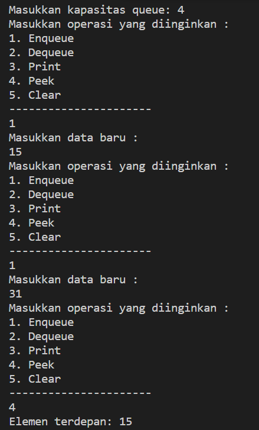
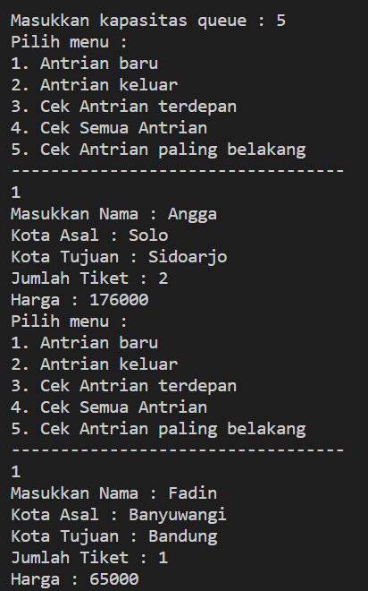

# Laporan Praktikum Pertemuan 7
### JOBSHEET QUEUE 
 
NAMA  : DIMAS ROSYIDIN

NIM   : 2241760054  

KELAS : 2B

PRODI : SISTEM INFORMASI BISNIS

JURUSAN : TEKNOLOGI INFORMASI

* ### PERCOBAAN 1
OUTPUT :

7.2.3 Jawaban

1. Pada method Create, mengapa atribut front dan rear diinisialisasi dengan nilai -1, tidak 0?  
    - Pada method Create, atribut front dan rear diinisialisasi dengan nilai -1 agar bisa membedakan antara kondisi queue kosong dan penuh. Jika keduanya diinisialisasi dengan 0, maka akan sulit untuk membedakan apakah queue sudah penuh atau masih kosong. 

2. Pada method Enqueue, jelaskan maksud dan kegunaan dari potongan kode berikut!  

        if (rear == max - 1) { 
        rear = 0;    
    - untuk menangani kasus ketika rear sudah mencapai akhir dari array (indeks maksimum). Jika sudah mencapai akhir, maka rear diubah menjadi 0 sehingga data dapat dimasukkan kembali dari awal. 

3. Perhatikan kembali method Enqueue, baris kode program manakah yang menunjukkan bahwa data baru disimpan pada posisi terakhir di dalam queue?   
    - Data baru disimpan pada posisi terakhir di dalam queue pada baris kode Q[rear] = data; pada method Enqueue 

4. Perhatikan kembali method Dequeue, baris kode program manakah yang menunjukkan bahwa data yang dikeluarkan adalah data pada posisi paling depan di dalam queue?  
    - Data yang dikeluarkan adalah data pada posisi paling depan di dalam queue, ditunjukkan oleh baris kode data = Q[front]; pada method Dequeue 

5. Pada method Dequeue, jelaskan maksud dan kegunaan dari potongan kode berikut! 

        if (front == max -1) {
        front = 0;    
    - untuk menangani kasus ketika front sudah mencapai akhir dari array (indeks maksimum). Jika sudah mencapai akhir, maka front diubah menjadi 0 sehingga dapat memulai pengambilan data dari awal lagi.

6. Pada method print, mengapa pada proses perulangan variabel i tidak dimulai dari 0 (int i=0),
melainkan int i=front?    
    - Pada method print, perulangan dimulai dari int i = front; karena front menunjukkan posisi elemen terdepan dalam queue. Dengan demikian, perulangan akan dimulai dari elemen terdepan hingga elemen sebelum rear.
7. Perhatikan kembali method print, jelaskan maksud dari potongan kode berikut!  

        i = ( i +! ) % max;  
    - digunakan untuk memastikan bahwa indeks i tetap dalam rentang yang valid (0 hingga max-1), agar tidak terjadi wrapping jika rear telah berpindah ke indeks array setelah mencapai akhir  

* ### PERCOBAAN 2
OUTPUT :

7.2.3 Jawaban

1. Perhatikan class Queue, apa fungsi kode program berikut pada method Dequeue?  

        Penumpang data = new Penumpang 
        ("", "", "", 0, 0);   
    - digunakan untuk menginisialisasi objek data dengan nilai default. 

2. Pada soal nomor 1, apabila kode program tersebut diganti dengan kode berikut: 

        Penumpang data = new Penumpang()  

    Apakah yang terjadi? Mengapa demikian?   
    - memerlukan beberapa argumen untuk menginisialisasi atribut nama, kotaAsal, kotaTujuan, jumlahTiket, dan harga. 

3. Tunjukkan kode program yang digunakan untuk menampilkan data yang dikeluarkan dari queue!  

        System.out.println("Antrian yang keluar : " + data.nama + " " + data.kotaAsal + " " + data.kotaTujuan + " " + data.jumlahTiket + " " + data.harga); 

4. Lakukan modifikasi program dengan menambahkan method baru bernama peekRear pada class
Queue yang digunakan untuk mengecek antrian yang berada di posisi belakang! Tambahkan pula
daftar menu 5. Cek Antrian paling belakang pada class QueueMain sehingga method peekRear
dapat dipanggil!    

     

* ### TUGAS
1. OUTPUT :

2. OUTPUT :

