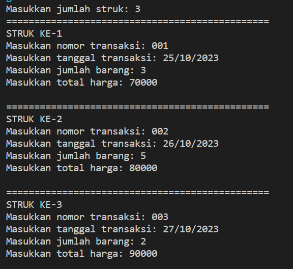

# Laporan Praktikum Pertemuan 7
### JOBSHEET STACK 
 
NAMA  : DIMAS ROSYIDIN

NIM   : 2241760054  

KELAS : 2B

PRODI : SISTEM INFORMASI BISNIS

JURUSAN : TEKNOLOGI INFORMASI

* ### PERCOBAAN 1
OUTPUT :

7.2.3 Jawaban 

1. untuk menciptakan objek tumpukan dengan kapasitas yang telah ditentukan 
2. 
4. karena kapasitas yang ditentukan hanya 5, jadi hanya angka 18 yang bisa masuk stack

* ### PERCOBAAN 2
OUTPUT :

7.3.3 Jawaban

1. judul, nama pengarang, tahun terbit, jumlah halaman, dan harga.
2. Stack st = new Stack(5); 
3. Fungsi dari konstruksi do-while adalah untuk memasukkan data buku ke dalam stack lebih dari sekali. Di dalam blok do, pengguna memasukkan informasi buku seperti judul, nama pengarang, tahun terbit, jumlah halaman, dan harga. Setelah data dimasukkan, pengguna akan ditanya apakah ingin menambahkan data buku baru atau tidak. Jika pengguna memilih untuk menambahkan data baru (memasukkan 'y' atau 'Y'), maka proses memasukkan data akan diulangi. 
4. 

* ### PERCOBAAN 3
OUTPUT :

7.4.3 Jawaban

1. Nilai derajat digunakan dalam proses konversi untuk menentukan urutan atau prioritas operasi saat mengonversi ekspresi infix ke postfix. Operator dengan derajat lebih tinggi akan memiliki prioritas lebih tinggi dalam urutan operasi.
2. untuk menyimpan karakter dari string Q pada indeks ke-i. 
3. OUTPUT :

4. tanda kurung hanya berfungsi untuk mengelompokkan operasi matematika dan tidak termasuk dalam operasi sendiri.

* ### TUGAS

1. OUTPUT :

2. OUTPUT :

