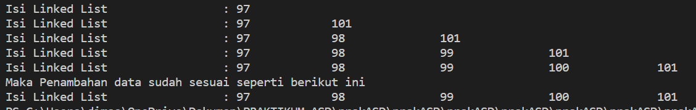

# Laporan Praktikum Pertemuan 8
LINKED LIST
 
NAMA  : DIMAS ROSYIDIN

NIM   : 2241760054  

KELAS : 2B

PRODI : SISTEM INFORMASI BISNIS

JURUSAN : TEKNOLOGI INFORMASI

* ### SINGLE LINKED LIST

OUTPUT :

9.2.3 Jawaban

1. karena linked list (node) masih belum memiliki isi / data, dimana pada sllMain langsung dilakukan pemanggilan method print diawal pemanggilan yang mana node masih belum di isi data sama sekali, sehingga system akan menampilkan "Linked List Kosong"
2. kegunaan potongan kode diatas adalah jika temp.data sama dengan key, maka kode program otomatis mengubah nilai variabel ndInput.next menjadi variabel temp.next serta nantinya pada variable ndInput untuk menyimpan nilainya
3. kegunaan potongan kode diatas adalah jika temp.next.next == nul maka akan mengembalikan nilai -1 atau data kosong, dan jika tidak ada kondisi yang terpenuhi sama sekali maka akan mengembalikan nilai dari index yaitu 0

* ### SINGLE LINKED LIST

OUTPUT :

9.2.3 Jawaban
1. untuk menghentikan perulangan / loop. terdapat dua break yang ada pada method remove, break yang pertama berfunngsi untuk jika data yang dihapus ada pada head dan ditemukan maka program akan langsung break, break yang kedua berfungsi untuk jika data yang dihapus berada ditengah dan ditemukan maka program akan langsung break
2. untuk jika node yang dipilih memiliki data yang sama (equals) dengan key, maka terjadi perubahan posisi dimana node tersebut akan digantikan oleh node yang selanjutnya
3.  method indexOf terdapat 2 return, yaitu :

- jika tmp == null maka akan mengembalikan nilai -1 atau data kosong
- jika tidak ada kondisi yang terpenuhi sama sekali maka akan mengembalikan nilai index yaitu 0

* ### TUGAS PRAKTIKUM 

1. Penambahan method insertBefore pada class SingleLinkedList : 

         public void insertBefore(int key, int input){
            Node ndInput = new Node(input, null);
            Node temp = head;
            Node prev = null;
        
            do{
                if(head.data == key){
                    addFirst(input);
                    break;
                }else if (temp.data == key){
                    ndInput.next = temp;
                    prev.next = ndInput;
                    if(temp.next == null){
                        tail = ndInput;
                        break;
                    }
                }
                prev = temp;
                temp = temp.next;
            }while (temp != null);
        }

    Penambahan kode program pada class SLLMain :

            System.out.println("dibawah ini hasil output penambahan method insertBefore()");
            singLL.insertBefore(760, 450);
            singLL.print();

    
OUTPUT :

2. OUTPUT :

3. OUTPUT :

